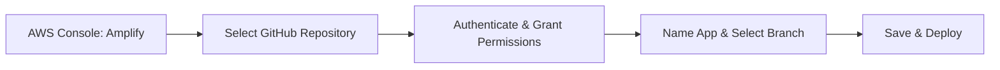

# 🚀 AWS Amplify Guide

A developer's quick reference guide to deploying, hosting, and managing applications on AWS Amplify with CI/CD, custom domains, and local sandboxes.

---

## 📌 Table of Contents
1. [What is AWS Amplify?](#-1-what-is-aws-amplify)
2. [Key Capabilities & Features](#-2-key-capabilities--features)
3. [Deploying a Static Website from GitHub](#-3-deploying-a-static-website-from-github)
4. [Setting up CI/CD Automation](#-4-setting-up-cicd-automation)
5. [Configuring a Custom Domain](#-5-configuring-a-custom-domain)
6. [Local Environment & Cloud Sandbox](#-6-local-environment--cloud-sandbox)
7. [Pricing & Free Tier Limits](#-7-pricing--free-tier-limits)

---

## 💡 1. What is AWS Amplify?

**AWS Amplify** is a complete set of purpose-built tools and features that lets frontend web and mobile developers quickly build and deploy fullstack applications on AWS. 

It consists of two main components:
1. **Amplify Hosting:** A fully managed hosting service for static websites and server-side rendered (SSR) web apps, featuring instant cache invalidation, custom domains, and built-in CI/CD.
2. **Amplify Framework:** CLI tools, libraries, and UI components to easily configure backends (databases, authentication, functions, APIs) directly from your codebase.

---

## 🛠️ 2. Key Capabilities & Features

* **Fullstack by Design:** Seamlessly configures serverless backends including databases (DynamoDB), Auth (Cognito), and APIs (GraphQL/REST).
* **Managed API & DB:** Backend components are provisioned, scaled, and managed automatically by Amplify itself.
* **Language/Framework Support:** Built for modern frameworks (React, Vue, Next.js, Angular, Nuxt) and mobile platforms (iOS, Android, Flutter, React Native).
* **Global Edge Network:** Content is served globally via Amazon CloudFront CDN, ensuring ultra-low latency.

---

## 📦 3. Deploying a Static Website from GitHub

Follow this step-by-step console guide to host your frontend:

### Steps:
1. Open the **AWS Console** and search for **AWS Amplify**.
2. Under "Get Started," select **Amplify Hosting** (or click **New App** -> **Host web app**).
3. Select **GitHub** as the repository source provider, and click **Next**.
4. Authenticate your GitHub account and grant AWS Amplify permissions to read your repository.
5. Choose your **Repository** and the target **Branch** (e.g., `main` or `production`), then click **Next**.
6. Give your application a name. Keep the default build settings (Amplify automatically detects framework build commands like `npm run build` and output directories like `dist` or `build`).
7. Review your configurations, then click **Save and Deploy**. 
8. Amplify will build and provision your site, providing a default domain (e.g., `https://main.d12345.amplifyapp.com`).

---

## ⚡ 4. Setting up CI/CD Automation

Amplify Hosting has **git-based auto-deployments** built-in:
* **Trigger-on-Push:** When you link a branch (like `main`), Amplify sets up a webhook in your GitHub repository.
* **Automatic Rebuilds:** Every time you push a code change (`git push`) or merge a Pull Request to that branch, Amplify automatically detects the change, triggers a new build pipeline, and deploys the updated version of your app.
* **No Downtime:** The active application continues to serve traffic. The new code only goes live once the entire build and deployment pipeline completes successfully.

---

## 🌐 5. Configuring a Custom Domain

To link your own domain (e.g., `mywebsite.com`) to the Amplify deployment:

### Steps:
1. In the AWS Amplify console, select your app and click **Hosting** -> **Custom domains** in the sidebar.
2. Click **Add domain**.
3. Enter your domain name (e.g., `example.com`) and configure redirection (e.g., redirecting `www.example.com` to `example.com`).
4. Click **Save**.
5. **Configure DNS (Domain Provider)**:
   * **If using Route 53:** Amplify automatically configures the records for you.
   * **If using third-party registrars (GoDaddy, Namecheap, Cloudflare):** Amplify will generate CNAME/TXT validation records. Go to your domain registrar's admin panel, open the DNS Management/Nameserver settings, and copy the CNAME records provided by Amplify.
6. **SSL Certification:** Amplify automatically generates and renews a free managed SSL/TLS certificate via AWS Certificate Manager (ACM).

---

## 💻 6. Local Environment & Cloud Sandbox

Amplify allows you to run backend sandboxes locally during development:
* **Local Sandbox:** Run local developer sandboxes using the Amplify CLI to prototype models, databases, and authentication schemas locally without deploying them to the cloud immediately.
* **Cloud Sandbox:** A developer-specific AWS cloud environment that updates in real time as you edit code on your local computer. When you run `npx amplify sandbox` in your local workspace terminal, it watches your local files and deploys changes to your personal cloud sandbox instantly, allowing you to test against real AWS resources.

---

## 💳 7. Pricing & Free Tier Limits

AWS Amplify offers a **Free Tier** for the first 12 months with limited configurations. If you exceed these limits, standard pay-as-you-go pricing applies.

### Free Tier Limits (First 12 Months):
| Metric | Free Tier Allowance | Over-Limit Standard Cost |
| :--- | :--- | :--- |
| **Build & Deploy** | **1,000** build minutes per month | $0.01 per additional build minute |
| **Hosting Storage** | **5 GB** stored per month | $0.023 per additional GB per month |
| **Data Transfer out** | **15 GB** served per month | $0.15 per additional GB served |

> [!NOTE]
> Standard AWS resource charges (like DynamoDB storage read/write units, Cognito users, and Lambda executions) are billed separately under their respective service free tiers and pricing plans.
