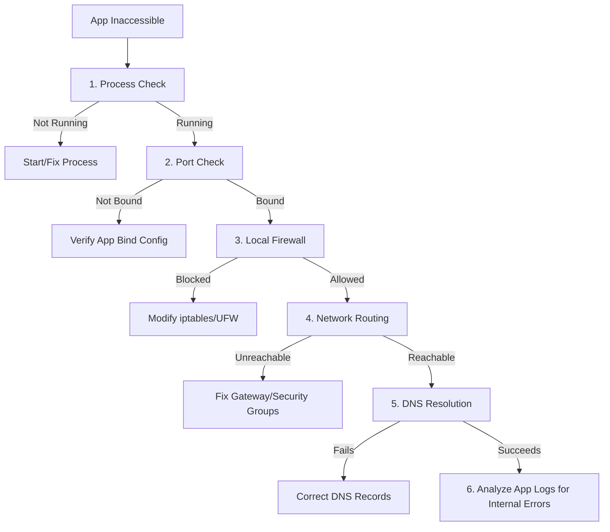

# 🐧 Linux & Kubernetes Troubleshooting Guide

A practical, question-and-answer reference guide for Linux system administration, network diagnostics, performance tuning, and Kubernetes container orchestration.

---

## 📌 Table of Contents
1. [Processes & Port Management](#-1-processes--port-management)
2. [File Monitoring & Text Search](#-2-file-monitoring--text-search)
3. [System Performance & Disk I/O](#-3-system-performance--disk-io)
4. [Network & Firewall Diagnostics](#-4-network--firewall-diagnostics)
5. [Nginx & Service Management](#-5-nginx--service-management)
6. [Kubernetes (K8s) Diagnostics](#-6-kubernetes-k8s-diagnostics)
7. [Permissions & File Operations](#-7-permissions--file-operations)
8. [End-to-End Application Inaccessibility Workflow](#-8-end-to-end-application-inaccessibility-workflow)

---

## ⚙️ 1. Processes & Port Management

### Q1. How do you find which process is using port 8080?
Use one of the following commands to identify the listening process:
```bash
# Option 1: Using lsof (list open files)
lsof -i :8080

# Option 2: Using ss (modern socket statistics - fast)
ss -tulnp | grep :8080

# Option 3: Using netstat
netstat -tulnp | grep :8080
```
* **Flags breakdown (`ss` / `netstat`):** `-t` (TCP), `-u` (UDP), `-l` (listening sockets), `-n` (numeric ports/IPs), `-p` (show PID/Program name).

---

### Q2. A process is listening on port 8080 with PID 1234. How do you stop it?
```bash
# 1. Send SIGTERM (graceful shutdown signal)
kill 1234

# 2. If it refuses to exit, send SIGKILL (immediate force shutdown)
kill -9 1234
```

---

### Q3. How do you find the PID of a running nginx process?
```bash
# Option 1: Using pgrep (returns PIDs only)
pgrep nginx

# Option 2: Using pidof (exact program match)
pidof nginx

# Option 3: Using ps and filtering
ps aux | grep [n]ginx
```
> [!TIP]
> Enclosing the first letter of the search query in brackets (`[n]ginx`) prevents `grep` from matching its own search process in the `ps` list.

---

### Q4. How do you verify whether an application is listening on port 8080?
Verify local socket bindings and accessibility:
```bash
# Option 1: Using netcat (nc) to test TCP connection
nc -zv localhost 8080

# Option 2: Using curl to fetch HTTP headers
curl -I http://localhost:8080

# Option 3: Check socket stats
ss -tuln | grep :8080
```

---

### Q5. How do you verify whether port 443 is reachable on a remote server?
Use network tools to probe the remote port:
```bash
# Option 1: Using netcat (nc)
nc -zv remote-host.com 443

# Option 2: Using telnet
telnet remote-host.com 443

# Option 3: Using curl (HTTPS handshake check)
curl -Iv https://remote-host.com
```

---

### Q6. If nothing is listening on port 8080, what would you investigate next?
If no socket binding is active on port 8080:
1. **Check Application Logs**: Read the startup logs to see if the server crashed, failed to initialize, or encountered a port conflict.
2. **Review Config Files**: Verify the application is configured to bind to port 8080 (and not another port, or restricted to `127.0.0.1` when testing externally).
3. **Verify Service Status**: Ensure the systemd service or Docker container is actually running:
   ```bash
   systemctl status my-app
   # or
   docker ps -a
   ```

---

### Q7. How do you inspect the parent process of a running process?
```bash
# Option 1: Using ps format (shows Parent PID as PPID)
ps -o ppid= -p <PID>

# Option 2: Visualizing process tree
pstree -p -s <PID>

# Option 3: Read from /proc filesystem
cat /proc/<PID>/status | grep PPid
```

---

### Q8. How do you check if a process is running inside Docker?
Inside the process or container terminal environment:
```bash
# Check 1: Look for the .dockerenv file at root
ls -la /.dockerenv

# Check 2: Check cgroup file contents (will list 'docker' or 'kubepods' paths)
cat /proc/1/cgroup
```

---

### Q9. How do you check if a process is being managed by Kubernetes?
A container process managed by Kubernetes will have:
1. **Kubernetes API Environment Variables**:
   ```bash
   env | grep KUBERNETES_
   ```
2. **Service Account Token Directory Mount**:
   ```bash
   ls -la /var/run/secrets/kubernetes.io/serviceaccount/
   ```

---

## 📝 2. File Monitoring & Text Search

### Q10. How do you monitor a log file in real time?
```bash
# Option 1: Standard real-time follow
tail -f /var/log/syslog

# Option 2: Follow and keep trying if the file is rotated/replaced
tail -F /var/log/syslog

# Option 3: Using less (Press Shift+F to start following; Ctrl+C to stop following and navigate)
less /var/log/syslog
```

---

### Q11. How do you search for the word "ERROR" in a log file while ignoring case and showing line numbers?
```bash
grep -in "ERROR" /var/log/app.log
```
* **Flags**: `-i` (ignore case), `-n` (show line numbers), `-r`/`-R` (can be added for recursive directories).

---

### Q12. How do you count the number of ERROR messages in a log file?
```bash
grep -o -i "ERROR" /var/log/app.log | wc -l
```
* **Flags**: `grep -o` outputs only the exact matching parts (one per line) preventing multiple errors on one line from throwing off the count, and `wc -l` counts the resulting lines.

---

### Q13. How do you view the last 100 lines of a large log file?
```bash
tail -n 100 /var/log/nginx/error.log
```

---

### Q14. How do you view the last 50 log entries of a service?
If the service is managed by systemd (`journalctl`):
```bash
journalctl -u nginx.service -n 50 --no-pager
```
For standard log files:
```bash
tail -n 50 /var/log/nginx/access.log
```

---

## 📊 3. System Performance & Disk I/O

### Q15. How do you check CPU usage on a Linux server?
```bash
# Option 1: Live interactive process monitor
htop  # (or standard 'top')

# Option 2: Snapshot of system stats (reports cpu idle, user, system percentages)
vmstat 1 5

# Option 3: Individual CPU stats breakdown
mpstat -P ALL 1
```

---

### Q16. How do you check memory usage on a Linux server?
```bash
# Option 1: Human-readable RAM usage stats
free -h

# Option 2: Detailed virtual memory stats
vmstat -s

# Option 3: Hardware-level breakdown
cat /proc/meminfo
```

---

### Q17. How do you check disk usage on a Linux server?
```bash
df -h
```
* **Flags**: `-h` renders sizes in human-readable GB/MB formatting.

---

### Q18. How do you identify which directories under `/var` are consuming the most disk space?
```bash
# Summarize directory space, sort numerically in human-readable format, show top 20
du -h --max-depth=1 /var | sort -h
```

---

### Q19. How do you find all files larger than 100 MB under `/var`?
```bash
find /var -type f -size +100M -exec ls -lh {} \;
```
* **Flags**: `-type f` (only files), `-size +100M` (greater than 100 Megabytes).

---

### Q20. How do you identify the top 5 memory-consuming processes?
```bash
ps aux --sort=-%mem | head -n 6
```
> [!NOTE]
> `head -n 6` includes the `ps` column header line plus the top 5 resource-consuming processes.

---

### Q21. How do you identify the top 5 CPU-consuming processes?
```bash
ps aux --sort=-%cpu | head -n 6
```

---

### Q22. How do you determine which filesystem is full on a Linux server?
Run `df -h` to see the utilization (`Use%`) of all mounted filesystems:
```bash
df -h | grep -E '100%|[9][0-9]%'
```

---

### Q23. How do you find the largest directories in a filesystem?
```bash
du -ah / 2>/dev/null | sort -rh | head -n 10
```
> [!TIP]
> Appending `2>/dev/null` silences permission warnings on directories you don't have read privileges for, keeping output clean.

---

### Q24. A server disk is 100% full. What steps would you take to troubleshoot it?
1. **Locate Large Offenders**: Find where space is being eaten (`du -sh /* 2>/dev/null | sort -h`).
2. **Clean Package Caches**:
   ```bash
   sudo apt-get clean # Ubuntu/Debian
   sudo yum clean all # CentOS/RHEL
   ```
3. **Verify Log Rotation**: Ensure `/var/log` logs are compressed. Truncate active logs instead of deleting them if they are locked:
   ```bash
   cat /dev/null > /var/log/huge_file.log
   ```
4. **Identify Deleted Files (LSOF)**: Check if a deleted file is still held open by a running process (see Q25).

---

### Q25. How do you detect deleted files that are still consuming disk space?
If you delete a large file while a process is still writing to it, the space is not freed until the process exits. Detect these using `lsof`:
```bash
lsof +L1
# or
lsof | grep '(deleted)'
```
* **Resolution**: Restart the process holding the file descriptor (e.g., `systemctl restart nginx`).

---

### Q26. CPU and memory look normal, but the application is slow. How do you investigate disk I/O bottlenecks?
If system memory and CPU are fine, high disk wait times (`iowait`) slow down processes:
```bash
# Monitor disk read/write throughput and extended stats (look at %util and await columns)
iostat -xz 1 10
```

---

### Q27. Which commands would you use to identify processes causing high disk I/O?
```bash
# Monitor IO metrics on active processes in real time
sudo iotop -o

# Alternatively, check disk statistics per process
pidstat -d 1
```

---

## 🌐 4. Network & Firewall Diagnostics

### Q28. How do you check whether a firewall is blocking a specific port?
Check local packet filter configurations or inspect external connection handshakes:
```bash
# Option 1: Check IPTables rules
sudo iptables -L -n -v | grep 8080

# Option 2: Check UFW status (Ubuntu)
sudo ufw status verbose

# Option 3: Trace TCP path (checks if packet drops mid-route)
traceroute -T -p 8080 remote-host
```

---

### Q29. How do you verify DNS resolution for a domain?
```bash
# Option 1: dig (detailed DNS trace query)
dig google.com

# Option 2: nslookup (simple lookups)
nslookup google.com

# Option 3: host command
host google.com
```

---

### Q30. How do you verify network connectivity to a remote host?
```bash
# Option 1: Ping checks (ICMP echo request)
ping -c 4 remote-host.com

# Option 2: MTR (Combined ping + traceroute - path diagnostics)
mtr -c 10 --report remote-host.com
```

---

### Q31. How do you copy a file from your local machine to a remote Linux server?
```bash
# Option 1: Using SCP
scp /path/to/local/file.txt user@remote-ip:/path/to/destination/

# Option 2: Using Rsync (Efficient, supports progress resume)
rsync -avzP /path/to/local/file.txt user@remote-ip:/path/to/destination/
```

---

## 🐳 5. Nginx & Service Management

### Q32. How do you check whether nginx is running?
```bash
# Option 1: Check via systemd
systemctl status nginx

# Option 2: Check for active nginx listening processes
ps aux | grep [n]ginx
```

---

### Q33. After modifying nginx configuration, how do you validate the configuration?
Always run syntax verification before reloading or restarting to prevent service downtime:
```bash
sudo nginx -t
```

---

### Q34. How do you reload nginx without downtime?
Instead of restarting, trigger a configuration hot-reload (sends SIGHUP to the master process to spawn new workers and gracefully close old ones):
```bash
sudo nginx -s reload
# or
sudo systemctl reload nginx
```

---

### Q35. How do you determine whether a service is managed by systemd?
```bash
# Check if systemd recognizes the service unit file
systemctl list-unit-files | grep my-service

# Check if PID 1 is systemd (indicating systemd initialization)
ps -p 1 -o comm=
```

---

### Q36. How do you verify whether a service has successfully started after a restart?
```bash
# 1. Check active state
systemctl is-active my-service

# 2. View recent logs since startup
journalctl -u my-service --since "5 minutes ago"
```

---

### Q37. How do you identify the root cause of a service startup failure?
1. **Inspect Systemd Status**:
   ```bash
   systemctl status my-service
   ```
2. **Review Detailed Logs**:
   ```bash
   journalctl -xeu my-service
   ```
3. **Inspect Config Syntax**: Check if there are service-specific config test commands (e.g., `nginx -t`, `apachectl configtest`).

---

### Q38. You kill a process, but it automatically restarts. What could be the reason?
A process auto-restarting is spawned or monitored by:
1. **Systemd Services**: A systemd unit file with configured `Restart=always` or `Restart=on-failure`.
2. **Supervisord / PM2**: External process managers configured to daemonize the application.
3. **Docker Containers**: A container built with `--restart always` or `restart: unless-stopped`.
4. **Cron Job / Script**: A background monitoring script/crontab running continuously.

---

## ☸️ 6. Kubernetes (K8s) Diagnostics

### Q39. A Kubernetes pod is in CrashLoopBackOff. What are the first three commands you would run?
```bash
# Command 1: Inspect detailed deployment events and lifecycle states
kubectl describe pod <pod-name>

# Command 2: Fetch application stdout/stderr logs
kubectl logs <pod-name>

# Command 3: Retrieve logs of the previous crashed instance
kubectl logs <pod-name> --previous
```

---

### Q40. A Kubernetes pod is stuck in Pending state. How would you troubleshoot it?
Identify the scheduling blockage:
```bash
# 1. Fetch scheduler events from the pod description
kubectl describe pod <pod-name>

# 2. Check cluster-wide scheduler events
kubectl get events --sort-by='.metadata.creationTimestamp'
```

---

### Q41. What are the most common reasons a pod remains in Pending state?
* **Insufficient Resources**: No node in the cluster has enough unallocated CPU or Memory to satisfy the pod's `resources.requests`.
* **Unschedulable Nodes**: Nodes are cordoned or marked unschedulable.
* **Affinity/Selector Mismatches**: Pod's `nodeSelector`, `nodeAffinity`, or `podAntiAffinity` rules cannot match active nodes.
* **Taints and Tolerations**: Active nodes contain taints that the pod does not have matching tolerations for.
* **Persistent Volume Claim (PVC) issues**: The PVC required by the pod is not bound or is in a different availability zone.

---

### Q42. How do you determine whether a pod failed due to insufficient CPU or memory?
Inspect the pod events:
```bash
kubectl describe pod <pod-name>
```
Look for:
* **Events**: `FailedScheduling` indicating `Insufficient cpu` or `Insufficient memory`.
* **OOMKilled status**: Under Container Statuses, look for `Terminated` with `Reason: OOMKilled` (killed by system for going over configured memory limit).

---

### Q43. How do you investigate node selector or affinity issues preventing pod scheduling?
1. Check Pod's node configuration requirements:
   ```bash
   kubectl get pod <pod-name> -o jsonpath='{.spec.nodeSelector}'
   ```
2. Inspect labels on active cluster nodes:
   ```bash
   kubectl get nodes --show-labels
   ```
Verify that at least one node's labels match the criteria requested by the Pod.

---

### Q44. How do you identify taints and tolerations issues affecting pod scheduling?
1. Check taints present on all cluster nodes:
   ```bash
   kubectl get nodes -o custom-columns=NAME:.metadata.name,TAINTS:.spec.taints
   ```
2. Verify Pod tolerations:
   ```bash
   kubectl get pod <pod-name> -o jsonpath='{.spec.tolerations}'
   ```
Ensure the Pod has a matching toleration for any node taint (e.g., `NoSchedule`).

---

### Q45. How do you check Kubernetes events related to a pod failure?
```bash
kubectl get events --field-selector involvedObject.name=<pod-name>
```

---

### Q46. How do you view logs from a previous crashed container?
```bash
kubectl logs <pod-name> -p
# or
kubectl logs <pod-name> --previous
```

---

## 🔒 7. Permissions & File Operations

### Q47. A shell script returns "Permission denied." How would you fix it?
1. **Add Execute Permissions**:
   ```bash
   chmod +x script.sh
   ```
2. **Verify Execution Path Mounts**: Check if the script resides on a partition mounted with `noexec` flags:
   ```bash
   mount | grep noexec
   ```
3. **Verify Script Header**: Ensure the interpreter shebang (`#!/bin/bash` or `#!/bin/sh`) points to a valid file path that you have access to read/run.

---

### Q48. How do you find files modified within the last 24 hours?
```bash
find /path/to/search -type f -mtime -1
```
* **Flags**: `-mtime -1` checks for changes in the last 24 hours (less than 1 day ago). Use `-mmin -60` to find files modified within the last hour (less than 60 minutes ago).

---

## 🚦 8. End-to-End Application Inaccessibility Workflow

### Q49. An application is inaccessible. What is your step-by-step troubleshooting approach?



### Complete Breakdown:

#### Step 1: Process Check
Verify if the target application's daemon or process is actually running on the server:
```bash
ps aux | grep [m]y-app
```
* **Remedy**: Start the application or check application logs for startup failures.

#### Step 2: Port Binding Check
Verify if the application is successfully listening on the correct network port (e.g., 8080):
```bash
ss -tulnp | grep :8080
```
* **Verify**: Is the port bound to `0.0.0.0` (all interfaces) or restricted to `127.0.0.1` (localhost only)? If bound only to localhost, external traffic cannot connect.

#### Step 3: Local Host Firewall Check
Check if host-level firewalls (like UFW or iptables) are blocking incoming traffic to that port:
```bash
sudo ufw status
# or
sudo iptables -L -n -v
```
* **Remedy**: Open the port (`sudo ufw allow 8080/tcp`).

#### Step 4: Network & Infrastructure Routing Check
Test connection reachability from an external client or intermediate network hop:
```bash
nc -zv <server-ip> 8080
```
* **Verify**: Check cloud security groups (AWS Security Groups, GCP Firewalls) or network ACLs to ensure traffic is allowed to route to the instance.

#### Step 5: DNS Check
If the application is accessed via a domain name (e.g., `app.example.com`), ensure it resolves to the correct IP address:
```bash
nslookup app.example.com
```

#### Step 6: Application Layer Inspection
If network connectivity succeeds but requests fail (e.g., HTTP 500/502), analyze the application's access and error logs to debug internal code exceptions or database connectivity blockages.
