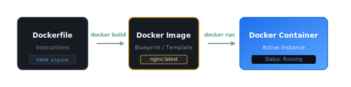
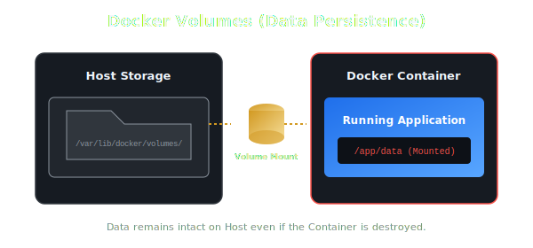
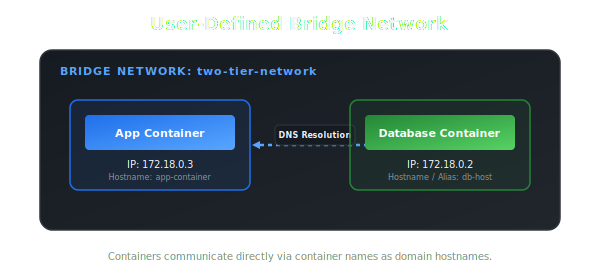

# 🐳 Ultimate Docker Revision Guide & Cheat Sheet

A comprehensive, production-ready reference guide for Docker core concepts, CLI operations, networking, storage, orchestration, and optimization patterns.

---

## 📌 Table of Contents
1. [Why Docker?](#-1-why-docker)
2. [Docker Architecture & Terminology](#-2-docker-architecture--terminology)
3. [Installation & Configuration](#-3-installation--configuration)
4. [Images vs. Containers](#-4-images-vs-containers)
5. [Basic Operations & Port Mapping](#-5-basic-operations--port-mapping)
6. [Writing Dockerfiles (Declarative Setup)](#-6-writing-dockerfiles-declarative-setup)
7. [Core Dockerfile Comparison Tables](#-7-core-dockerfile-comparison-tables)
8. [Docker Volumes (Data Persistence)](#-8-docker-volumes-data-persistence)
9. [Docker Networking](#-9-docker-networking)
10. [Docker Compose](#-10-docker-compose)
11. [Modern Docker Tooling (Init & Scout)](#-11-modern-docker-tooling-init--scout)
12. [Multi-Stage Builds (Optimization)](#-12-multi-stage-builds-optimization)

---

## 💡 1. Why Docker?

One of the most classic issues in software development is:
> **"It works on my machine, but fails in production."**

This environments mismatch is typically caused by variations in:
* Operating System versions
* Library and dependencies versions
* Runtime environments & configurations

### The Shift: From VMs to Docker Containers


Docker solves this by packaging the application, runtime, system tools, libraries, and settings into a single, lightweight **container** that runs identically on any environment.

---

## 🏗️ 2. Docker Architecture & Terminology

Docker uses a client-server architecture. The Docker **Client** talks to the Docker **Daemon**, which does the heavy lifting of building, running, and distributing your Docker containers.


* **Docker CLI:** The command-line tool (`docker`) that developers use to send commands to the Docker Daemon.
* **Docker Daemon (`dockerd`):** A background service running on the host OS that manages Docker objects (images, containers, networks, and volumes).
* **Docker Engine:** The client-server application consisting of the CLI, REST API, and Daemon.
* **containerd:** The industry-standard container runtime that manages the complete container lifecycle (starts, stops, and runs them).

---

## ⚙️ 3. Installation & Configuration

### Debian / Ubuntu Setup

1. **Update packages index:**
   ```bash
   sudo apt-get update
   ```

2. **Install Docker Engine & CLI:**
   ```bash
   sudo apt-get install docker.io -y
   ```

3. **Verify installation:**
   ```bash
   docker --version
   ```

### 🔑 4. Give Docker Permissions (Avoid `sudo`)

By default, the Docker daemon binds to a Unix socket owned by `root`. To run Docker commands without prefixing them with `sudo`, add your user to the `docker` group:

```bash
# Create the docker group (usually created automatically during install)
sudo groupadd docker

# Add your current user to the docker group
sudo usermod -aG docker $USER

# Apply the new group membership immediately to your current shell session
newgrp docker
```
> [!TIP]
> Alternatively, you can log out and log back in to reload your user permissions system-wide.

---

## 🎛️ 5. Basic Operations & Port Mapping

### Diagnostic Commands
* **General CLI Help:** `docker --help`
* **Version Details:** `docker version`
* **System-wide Info:** `docker info`

---

## 📦 6. Images vs. Containers

| Object | Definition | State | Mutability |
| :--- | :--- | :--- | :--- |
| **Docker Image** | Read-only blueprint, template, or snapshot. Built from a Dockerfile. | Static (Stopped) | **Immutable** (Cannot be modified directly) |
| **Docker Container** | A runnable instance of an image. Includes a thin read-write layer on top. | Active (Running) | **Mutable** (Ephemeral storage layer) |



### Essential Container Lifecycle Commands

```bash
# Pull an image from Docker Hub without running it
docker pull nginx

# Run a container (pulls image if not present locally)
docker run nginx

# List all running containers
docker ps

# List ALL containers (active, exited, stopped)
docker ps -a

# Gracefully stop a running container
docker stop <container-id>

# Delete a stopped container
docker rm <container-id>

# View real-time container log outputs
docker logs <container-id>

# Stream/follow container logs actively
docker logs -f <container-id>
```

### 🔌 Port Mapping & Detached Mode

By default, containers are isolated and their internal ports are not accessible from the host network.

```bash
docker run -d -p 8080:80 nginx
```

* `-d` (Detached Mode): Runs the container in the background, freeing up your terminal.
* `-p 8080:80` (Port Mapping): Maps port `8080` on the **Host Machine** to port `80` inside the **Docker Container**.

```
Host (Browser)         Docker Engine          Nginx Container
  localhost:8080   ──>   Port 8080:80   ──>     Port 80 (Internal)
```

---

## ✍️ 7. Writing Dockerfiles (Declarative Setup)

Instead of manually configuring a container running imperatively, we use a **Dockerfile** to declare the state and build a repeatable image.

### Example: Dockerizing a Django application

Create a file named `Dockerfile` in the root of your project:

```dockerfile
# 1. Choose the base image
FROM python:3.9-slim

# 2. Set the working directory inside the container
WORKDIR /app

# 3. Copy everything from host directory to container WORKDIR
COPY . .

# 4. Install dependencies during image build phase
RUN pip install --no-cache-dir -r requirements.txt

# 5. Define default executable/command when container starts
CMD ["python", "manage.py", "runserver", "0.0.0.0:8000"]
```

### Build & Run the Custom Image

```bash
# Build the image with tag "notes-app" and version "latest" using current context (.)
docker build -t notes-app:latest .

# Run the newly built image in detached mode mapping host port 8000
docker run -d -p 8000:8000 notes-app:latest
```

---

## 📊 8. Core Dockerfile Comparison Tables

### A. COPY vs. ADD
| Feature | `COPY` | `ADD` |
| :--- | :--- | :--- |
| **Basic Copying** | Yes (local host files to container). | Yes. |
| **Remote URLs** | No (cannot fetch remote resources). | Yes (can download files via HTTP/HTTPS). |
| **Tar Extraction** | No (copies archive files as-is). | Yes (automatically unpacks local compressed archives). |
| **Recommendation** | **Best Practice** for 99% of file operations. | Use only when automatic extraction or URL fetches are required. |

---

### B. RUN vs. CMD
| Property | `RUN` | `CMD` |
| :--- | :--- | :--- |
| **Execution Phase** | **Build time** (during image creation). | **Run time** (when container boots up). |
| **Outcome** | Commits changes to the image layers. | Does not modify the image. Sets default process. |
| **Multiplicity** | Can have multiple `RUN` instructions. | Only the **last** `CMD` is executed; others are ignored. |
| **Example** | `RUN apt-get install -y curl` | `CMD ["npm", "start"]` |

---

### C. CMD vs. ENTRYPOINT
| Mode | `CMD` | `ENTRYPOINT` |
| :--- | :--- | :--- |
| **Overridability** | Easily overridden by appending args to `docker run`. | Not easily overridden; arguments append to it. |
| **Purpose** | Sets default arguments or generic command. | Defines the main executable of the container. |
| **Combination** | Acts as arguments for `ENTRYPOINT` when used together. | Serves as the primary entry executable. |

* **Example behavior override:**
  If your Dockerfile contains: `CMD ["echo", "Hello"]`
  Running `docker run my-image ls` will execute `ls` instead of `echo Hello`.
  
  If your Dockerfile contains: `ENTRYPOINT ["echo"]` and `CMD ["Hello"]`
  Running `docker run my-image world` will execute `echo world`.

---

## 💾 9. Docker Volumes (Data Persistence)

Containers are **ephemeral**. Any data written inside a container is lost when the container is deleted.



**Docker Volumes** map a folder inside the container to a directory managed by Docker on the host machine, persisting data even if the container is destroyed.

```bash
# Create a named volume
docker volume create notes-volume

# List all volumes
docker volume ls

# Inspect volume metadata (shows mountpoint on host)
docker volume inspect notes-volume

# Run container with volume mounted
docker run -d -v notes-volume:/app/data nginx
```
> Format: `-v [VolumeName]:[ContainerFolderPath]`

---

## 🌐 10. Docker Networking

Docker networking allows containers to communicate with each other and with the host machine or external networks.



### Primary Network Drivers
1. **Bridge:** The default network driver. Perfect for standalone containers communicating on the same host.
2. **Host:** Removes network isolation between the container and the host (uses host's network directly).
3. **None:** Complete network isolation. No external communication.
4. **Overlay:** Enables multi-host communication (used in Docker Swarm).

### Dynamic Cross-Container Communication

```bash
# 1. Create a custom user-defined bridge network
docker network create two-tier-network

# 2. Run Database container inside the network
docker run -d --name db-host --network=two-tier-network -e MYSQL_ROOT_PASSWORD=secret mysql

# 3. Run Web App container in the same network
# The app can resolve the database container directly using its name "db-host" as the domain
docker run -d --name app-container --network=two-tier-network -p 8000:8000 notes-app
```

> [!NOTE]
> Custom bridge networks provide automatic DNS resolution. Containers can communicate using container names as hostnames instead of tracking IP addresses.

---

## 🎼 11. Docker Compose

Instead of running long, manual command-line commands for multi-container applications, **Docker Compose** lets you define your entire multi-container service stack in a single YAML file (`docker-compose.yml`).

### Example `docker-compose.yml`
```yaml
version: "3.8"

services:
  web:
    build: .
    ports:
      - "8000:8000"
    networks:
      - app-network
    depends_on:
      - db

  db:
    image: postgres:15
    environment:
      POSTGRES_DB: notes_db
      POSTGRES_USER: admin
      POSTGRES_PASSWORD: secretpassword
    volumes:
      - postgres_data:/var/lib/postgresql/data
    networks:
      - app-network

volumes:
  postgres_data:

networks:
  app-network:
    driver: bridge
```

### Compose Control Commands
```bash
# Build images and start all services in the background
docker compose up -d --build

# Check status of running compose stack services
docker compose ps

# View aggregate log outputs of all services
docker compose logs -f

# Stop and remove all containers, networks, and volumes defined in compose
docker compose down -v
```

---

## 🛠️ 12. Modern Docker Tooling (Init & Scout)

### 🚀 `docker init`
Runs an interactive CLI wizard that scans your codebase and automatically generates a suitable `Dockerfile`, `docker-compose.yml`, `.dockerignore`, and boilerplate `README.md`.
```bash
docker init
```

---

### 🛡️ `docker scout`
A built-in security auditing tool that scans container images for software vulnerabilities (CVEs) and policy violations.

```bash
# Log in to Docker Registry
docker login

# Quick high-level vulnerabilities assessment
docker scout quickview notes-app:latest

# Display detailed list of CVEs grouped by severity
docker scout cves notes-app:latest
```

---

## ⚡ 13. Multi-Stage Builds (Optimization)

### The Problem with Single-Stage Builds
When building modern applications (e.g., React/Angular or Go), the build environment needs tools like npm, compiler suites, etc., which are **not** needed to run the final app. Including these in the final image creates huge, slow, and insecure images.

### The Solution: Multi-Stage Build
Compile/build the app in a temporary build container, then copy **only the final built artifacts** into a clean, minimal runtime image.

```dockerfile
# ==========================================
# STAGE 1: Build / Compilation
# ==========================================
FROM node:18-alpine AS builder
WORKDIR /app
COPY package*.json ./
RUN npm install
COPY . .
RUN npm run build

# ==========================================
# STAGE 2: Lightweight Production Runtime
# ==========================================
FROM nginx:alpine
# Copy compiled static output from the builder stage
COPY --from=builder /app/dist /usr/share/nginx/html
EXPOSE 80
CMD ["nginx", "-g", "daemon off;"]
```

### Impact Metrics

| Metric | Single-Stage Build | Multi-Stage Build |
| :--- | :--- | :--- |
| **Image Size** | Large (includes Node runtime + `node_modules` + dev tools) | **Minimal** (only contains `nginx` + compiled HTML/JS) |
| **Security Risk** | High (more installed packages = larger attack surface) | **Low** (reduced packages and dependencies) |
| **Deployment Speed** | Slow (large payload to push/pull) | **Fast** (extremely small size, boots instantly) |
| **Build Artifacts** | Leftover temporary source files and build configurations | Production-ready distribution files only |